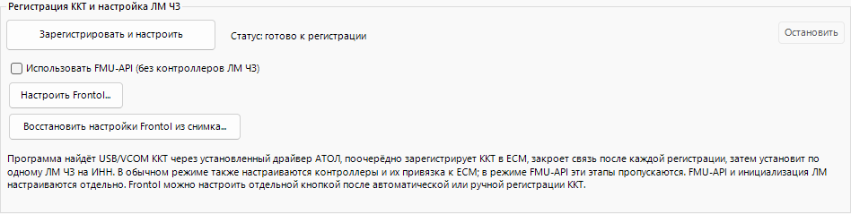

# Мульти-ККТ в ЕСМ/ТС ПИоТ

Windows-приложение для регистрации одной или нескольких ККТ в ЕСМ/ТС ПИоТ, настройки независимых контроллеров и ЛМ ЧЗ, а также безопасного удаления созданных экземпляров.

Текущая версия — **11.3.19.0**.

[Скачать полный ZIP](https://github.com/jadieify-hub/esm-tspiot-multi-kkt-tool/releases/tag/v11.3.19.0) · [Инструкция оператора](INSTRUCTION_FOR_DUMMIES.md) · [Изменения](docs/releases/11.3.19.0.md) · [Документация](docs/README.md)

## Возможности

- ручная и последовательная автоматическая регистрация ККТ через локальный API ЕСМ;
- отдельные контроллеры для каждой ККТ и один ЛМ ЧЗ на каждый ИНН;
- массовая обработка с независимым результатом по каждой кассе;
- подготовка ЛМ для FMU-API без создания контроллеров;
- отдельная настройка адреса и порта ЕСМ в Frontol 6.28;
- диагностика, повтор отдельных стадий и удаление только подтверждённых объектов MultiKKT.

## Требования

- Windows, .NET Framework 4.8 и права администратора;
- штатно установленные ЕСМ/ТС ПИоТ и Драйвер ККТ АТОЛ v.10;
- официальный MSI ЛМ ЧЗ от ЦРПТ; в обычном режиме также нужен установленный `ЕСП Контроллер ЛМ ЧЗ`;
- для Frontol: Frontol 6.28, его кассовый `Frontol.ini` и штатный Firebird с `isql.exe`.

Проверенная конфигурация Frontol — 6.28.8.87 / Firebird 2.1 / COM АТОЛ. Совместимость с другими схемами базы не заявляется.

## Установка и обновление

1. Скачайте `MultiKKT-ESM-TSPioT-11.3.19.0.zip` и `SHA256SUMS-MultiKKT-11.3.19.0.txt` из выпуска и проверьте SHA-256.
2. Распакуйте ZIP целиком в отдельную локальную папку.
3. Запустите `MultiKKT-ESM-TSPioT.exe` и подтвердите запрос UAC.
4. Откройте `INSTRUCTION_FOR_DUMMIES.txt` из поставки или меню `Справка` → `Инструкция`.

Для обновления закройте MultiKKT и распакуйте новый ZIP в новую папку. Не смешивайте EXE, DLL и каталог `Provisioner` разных версий. Замена папки утилиты не переустанавливает ЕСМ, ЛМ или Frontol и не удаляет созданные службы.

## Короткий автоматический сценарий

1. Закройте Frontol и `Тест драйвера ККТ`, если они удерживают кассы.
2. На вкладке `Автоматическая настройка` нажмите `Зарегистрировать и настроить`.
3. Дождитесь регистрации всех ККТ и отдельно подтвердите настройку контроллеров и ЛМ ЧЗ.
4. При необходимости выберите официальный MSI ЛМ ЧЗ.
5. После завершения отдельно выполните бизнес-инициализацию ЛМ и проверьте кассовое ПО, продажу и проверку марки.

Программа считает настройку завершённой после установки компонентов и принятия настроек ЕСМ. Готовность ЛМ и реальная продажа проверяются отдельно.

## Важные ограничения

### FMU-API

Режим FMU-API регистрирует ККТ и подготавливает по одному ЛМ с автозапуском на каждый ИНН, но не устанавливает сам FMU-API, не создаёт контроллеры и не выполняет привязку или бизнес-инициализацию. Интеграцию с кассовым ПО и офлайн-проверку марки нужно выполнить отдельно.

### Frontol

Перед настройкой закройте Frontol и Frontol Администратор и сделайте штатную резервную копию базы. JSON-снимок MultiKKT не заменяет резервную копию. Программа использует только кассовый `Frontol.ini`, сопоставляет ККТ по COM-порту и серийному номеру и меняет только `ECRDEV.ESMHOST` и `ECRDEV.ESMPORT`. Настройки подключения драйвера не меняются. После записи перезапустите Frontol и проверьте связь с физическими ККТ.

В поставке нет Firebird, FMU-API, вендорного MSI, `lmcontroller.exe`, Erlang runtime, баз данных, журналов или сертификатов клиента. Новые сценарии перед использованием на рабочей кассе проверяйте по [полевому чек-листу](docs/testing/2026-09-03-field-acceptance-full-contour.md).

## Документация и поддержка

- [Инструкция оператора](INSTRUCTION_FOR_DUMMIES.md)
- [Технические заметки](docs/technical-notes.md)
- [Полевая приёмка](docs/testing/2026-09-03-field-acceptance-full-contour.md)
- [GitHub Issues](https://github.com/jadieify-hub/esm-tspiot-multi-kkt-tool/issues) — сообщайте версию и прикладывайте только обезличенную диагностику

Добровольно поддержать разработку можно через [CloudTips](https://pay.cloudtips.ru/p/53698013). В программе ссылка и QR-код доступны через `Справка` → `Поддержать разработку`; простое открытие раздела не отправляет телеметрию или пользовательские данные.

## Лицензия и авторство

Программа бесплатна, в том числе для коммерческого использования, но не распространяется по свободной open-source лицензии. Продажа, изменение и распространение изменённых версий требуют письменного разрешения KRS. Полные условия — в [LICENSE](LICENSE).

- Разработчик: Руслан Керусов
- Издатель и владелец: KRS
- © 2026 KRS
